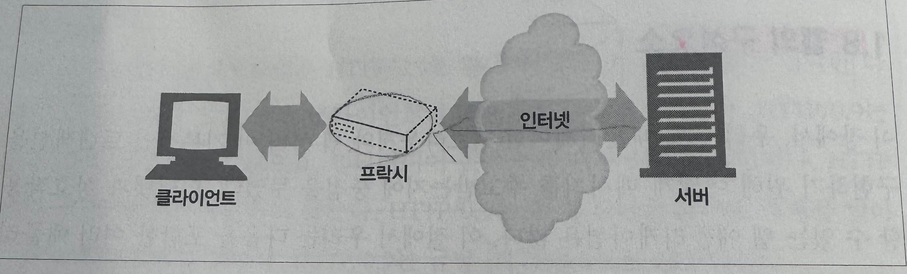
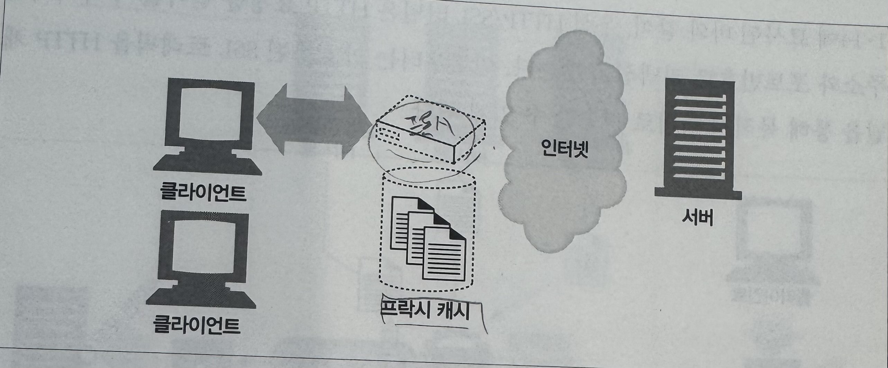
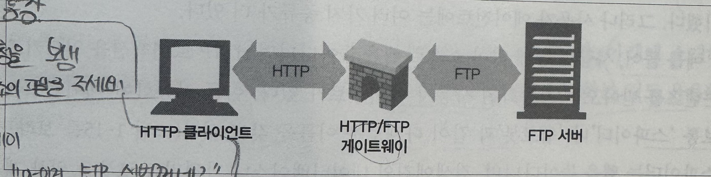
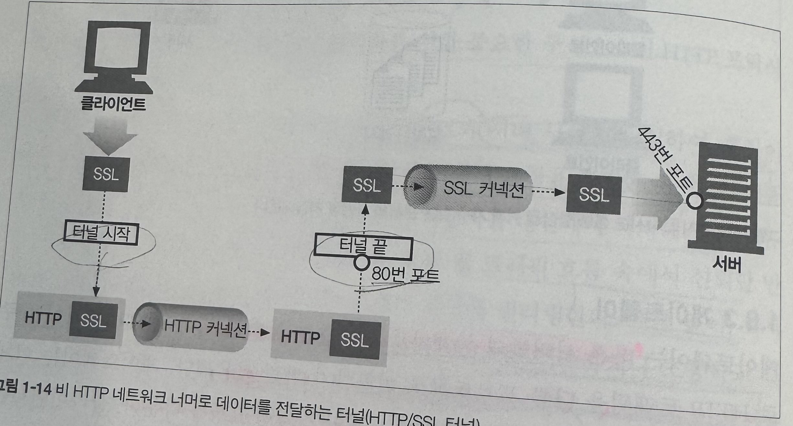
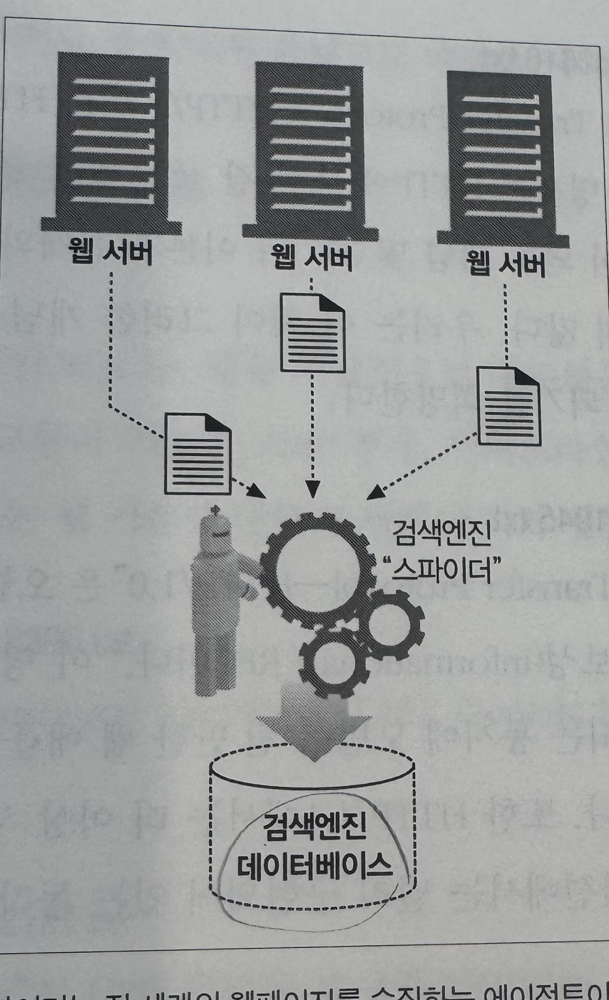

# 웹의 구성요소\_19p.

이 장에서, 우리는 웹 애플리케이션(웹브라우저와 웹 서버)이 기본적인 트랜잭션을 구현하기 위해 어떻게 메시지를 주고받는지에 대해 중점을 두었다. 인터넷과 상호작용 할 수 있는 웹 애플리케이션은 많다. 이 절에서 우리는 다음을 포함한 여러 애플리케이션에 대해 간략히 설명할 것이다.

### 프록시

클라이언트와 서버 사이에 위치한 HTTP 중개자

### 캐시

많이 찾는 웹페이지를 클라이언트 가까이에 보관하는 HTTP 창고

### 게이트웨이

다른 애플리케이션과 연결된 특별한 웹 서버

### 터널

단순히 HTTP 통신을 전달하기만 하는 특별한 프록시

### 에이전트

자동화된 HTTP 요청을 만드는 준지능적(semi-intelligent)웹클라이언트

## 1. 프록시

웹 보안, 애플리케이션 통합, 성능 최적화를 위한 중요한 구성요소인 HTTP 프록시 섭에 대해 살펴보자.

아래의 그림에서 보다시피, 프록시는 클라이언트와 서버 사이에 위치하여, **클라이언트의 모든 HTTP 요청을 받아 서버에 전달하다** (대개 요청을 수정한 뒤에), 이 애플리케이션은 사용자를 위한 프록시로 동작하며, **사용자를 대신해서 서버에 접근** 한다.
프록시는 주로 **보안을 위해 사용** 된다. 즉, 모든 웹 트래픽 흐름 속에 신뢰할 만한 중개자 역할을 한다. 또한 프록시는 **요청과 응답을 필터링** 한다. 예를 들어, 회사에서 무엇인가를 다운 받을 때 **애플리케이션 바이러스를 검출** 하거나, **초등학교 학생들에게서 성인콘텐츠를 차단** 한다. 프록시에 대해서는 6장에ㅓ 자세히 이야기 할 것이다.

## 2. 캐시

웹캐시와 캐시 프록시는 자신을 거쳐 가는 문서들 중 **자주 찾는 것의 사본을 저장**해 두는, 특별한 종류의 **HTTP 프록시 서버** 이다. 다음번에 클라이언트가 같은 문서를 요청하면 그 캐시가 갖고 있는 사본을 받을 수 있다.

클라이언트는 멀리 떨어진 웹 서버보다 근처의 캐시에서 훨씬 더 빨리 문서를 다운받을 수 있다. **HTTP는 캐시를 효율적으로 동작**하게 하고, **캐시된 콘텐츠를 치신 버전으로 유지** 하면서 동시에 **프라이버시도 보호** 하기 위한 많은 기능을 정의한다 우리는 7장에서 캐싱 기술에 대해 다룰 것이다.

## 3. 게이트웨이

게이트웨이는 **다른 서버들의 중개자로 동작하는 특별한 서버** 이다. 게이트에이는 주로 **HTTP 트래픽을 다른 프로토콜로 변환하기 위해 사용** 된다. 게이트웨이는 언제나 **스스로가 리소스를 갖고 있는 진짜 서버인 것처럼 요청을 다룬다** 클라이언트는 자신이 게이트웨이와 통신하고 있음을 알아채지 못할 것이다.

HTTP/FTP 게이트웨이는 FTP URI에 대한 HTTP 요청을 받아들인 뒤, FTP 프로토콜을 이용해 문서를 가져온다.

### + 브라우저는 FTP를 직접 다루지 못한다

- 브라우저는 기본적으로 HTTP 클라이언트임
- ! 그리고 여기서 게이트웨이가 등장!!!

**흐름**

1. 브라우저

- HTTP 요청을 보냄
- "FTP 주소의 파일을 주세요."

2. HTTP/FTP 게이트웨이

- HTTP 요청을 받음
- "아 이건 FTP 서버꺼네?"

3. 게이트웨이 -> FIP 서버

- FTP 프로토콜 사용해서 로그인
- 파일 요청 (file.txt)

4. FTP 서버 -> 파일 전송
5. 게이트웨이

- 받은 파일을 HTTP 응답 형태로 변환

6. 브라우저

- "이 파일이있네" 하고 받음

받아온 문서는 HTTP 메세지에 담겨 클라이언트에게 보낸다. 8장에서 게이트웨이에 대해 다룰 것이다.

## 4. 터널

터널은 **두 커낵션 사이에서 날(raw) 데이터를 열어보지 않고 그대로 전달해주는 HTTP 애플리케이션** 이다. HTTP 터널은 주로 비 HTTP 데이터를 하나 이상의 HTTP 연결을 통해 그대로 전송해주기 위해 사용된다.

HTTP 터널을 활용하는 대표적인 예로, 암호화된 SSL 트래픽을 HTTP 커넥션으로 전송함으로써 웹 트래픽만 허용하는 사내 방화벽을 통과시키는 것이다.

그림에서도 묘사된 바와 같이, 우선 HTTP/SSL 터널은 HTTP 요청을 받아들여 목적지의 주소와 포트번호로 커넥션을 맺는다. 이후부터는 암호화된 SSL 트래픽을 HTTP 채널을 통해 목적지 서버로 전송할 수 있게 된다.

## 5. 에이전트

사용자 에이전트(혹은 그냥 에이전트)는 **사용자를 위해 HTTP 요청을 만들어주는 클라이언트 프로그램** 이다 웹 요청을 만드는 애플리케이션은 뭐든 HTTP 에이전튿. 지금까지 우리는 한 가지 종류의 HTTP 에이전트, 웹 브라우저에 대해서만 이야기했다. 그러나 사용자 에이전트에는 여러 가지 종류가 더 있다.

예를 들어, 사람의 통제 없이 스스로 웹을 돌아다니며 HTTP 트랜잭션을 일으키고 콘텐츠를 방아오는 자동화된 사용자 에이전트가 있다.

이들 자동화된 에이전트는 보통 '스파이더'나 '웹로봇' 과 같이 다채로운 이름을 갖고 있다.

스파이더는 웹을 돌아다니며, 검색엔진의 데이터베이스나 가격비교 로봇을 위한 제품 카탈로그와 같은 유용한 웹 콘텐츠 보관소를 만든다. 자세한 것은 9장을 보도록 하자.
